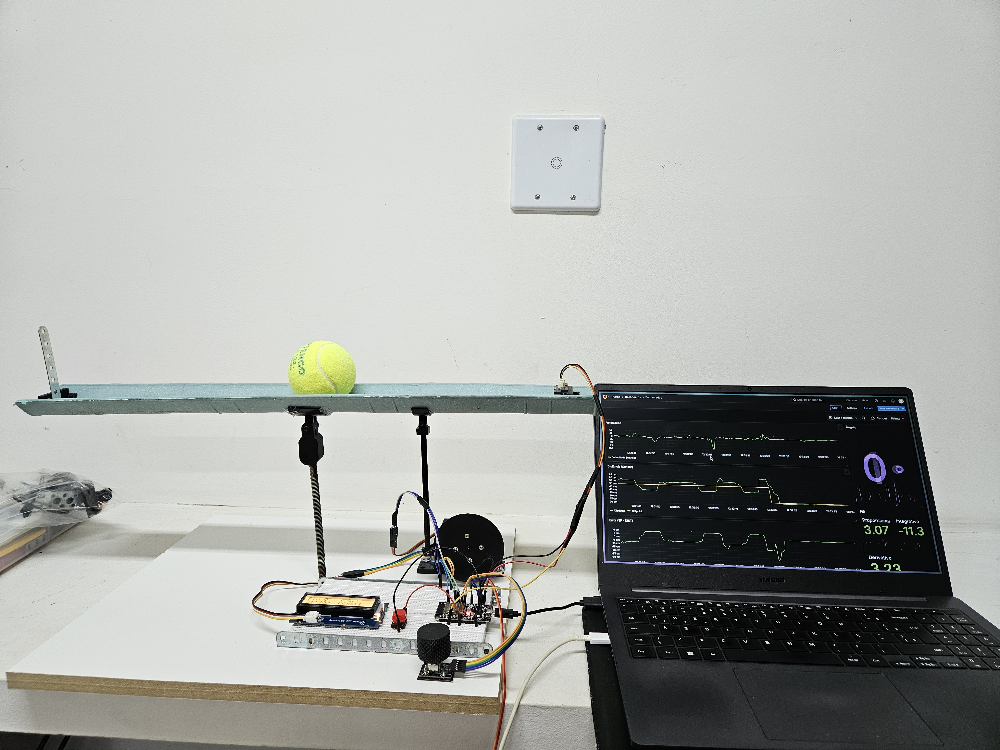

# Controlador PID para Controle de Distância

## Descrição do Projeto

Este projeto implementa um controlador PID (Proporcional-Integral-Derivativo) para controle preciso de distância utilizando um sensor infravermelho e um servo motor.

## Funcionalidades

- Controle de distância em tempo real
- Ajuste dinâmico de constantes P, I e D
- Visualização do estado no display LCD
- Envio de dados para banco de dados InfluxDB e visualização no grafana
- Modo de operação com seleção de ajuste de constantes

## Componentes Utilizados

- ESP32
- Sensor infravermelho
- Servo Motor
- Display LCD RGB
- Encoder rotativo

## Imagem do Projeto

## Demonstração em Vídeo

## Conexões

- Sensor Ultrassônico: Pino 34
- Servo Motor: Pino 26
- Display LCD: Via I2C
